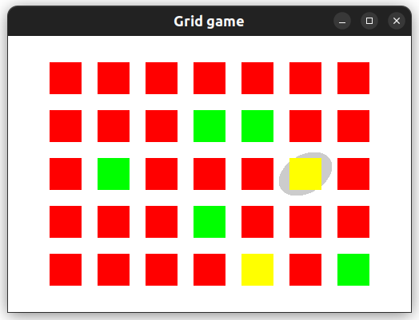

## Grid game demo



This is a simple scaffold to get started with mouse and keyboard interactivity on a two-dimensional grid.

## How to play

```
cabal run
```

Click on cells in the grid to cycle their color.
Alternatively, use arrow keys to navigate and spacebar to cycle a color.

There is no objective!

## Dependencies

On Ubuntu:

```
sudo apt install freeglut3 freeglut3-dev
```

## Related projects

The Game of Life example in [`gloss-examples`](https://hackage.haskell.org/package/gloss-examples) ([source code](https://github.com/benl23x5/gloss/tree/master/gloss-examples/picture/Conway)) is also a grid based display but without interactivity on individual cells.